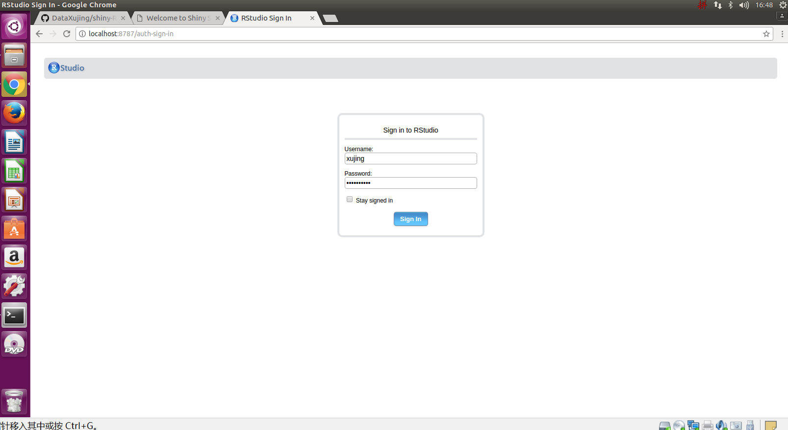
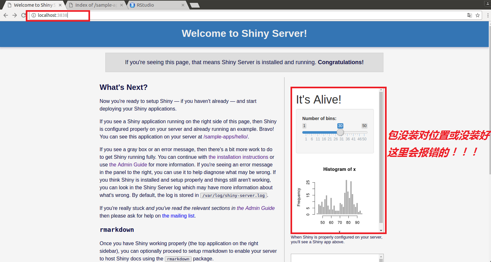
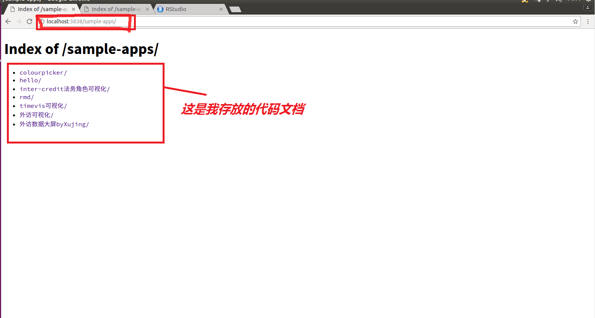
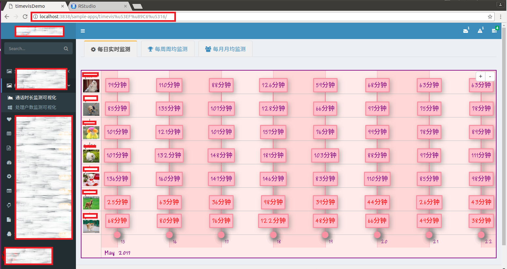

# Install-R-rstudio-server-shiny-server-git

by Xujing

## 1. 你应该装一个Ubuntu系统

首先安装一个虚拟机，然后安装Ubuntu，作者使用的为Ubuntu 16.04,所有安装配置
都是在该版本下进行的，建议虚拟机安装，这样可以在Windows系统和Ubuntu下随意切换
且无障碍copy文件，不推荐U盘安装Ubuntu双系统，这样在系统切换中需要重启电脑比较麻烦。
相关安装教程可参考：[VMareUbuntu安装详细过程](http://blog.csdn.net/u013142781/article/details/50529030)

## 2. Linux安装最新版本的R

安装步骤非常简单，且基本不会出现问题

+ step1: 打开终端，在终端内输入：sudo apt-get install r-base

+ step2: 更新软件源列表并更新R软件 sudo apt-get update; sudo apt-get install r-base r-base-dev;
此时输入R 可以打开看是否为最新版本

+ step3: 提示：如果已经安装了旧版本的R-base，或许用 sudo apt-get upgrade 也可以更新到最新版本

+ step4： 在终端中输入 R，如果能正常打开，恭喜你，你已经成功安装了最新版本的R,这里需要注意的是如果只运行
step1你可能仅仅安装了一两年前的版本，并非最新的R版本。

+ step5： 安装pacakges只需打开R输入：`install.packages("packagesnames")` 或`devtools::install-github("path/packagesnames")`
稍等片刻会提示选择镜像，然后就可以安装了，在安装过程中作者踩了很多坑，大体分为三类：ubuntu分配内存不足或缺少必备的一些依赖包
或者镜像资源不稳定。具体解决办法可在问题区域得到回答。

当然除了这种在线安装之外，你也可以选择离线安装.zip文件，安装步骤分为三步，下载，解压，安装相关教程可google或Baidu解决: [点我](http://blog.sina.com.cn/s/blog_6583048d01018ac5.html)中的方法2即可离线安装。

## 3. 安装 rstudio-server

rstudio server可以让你的rstudio运行在网页上，并且很好的与git结合进行数据科学项目的协同开发。它分为普通版和满血版(rstudio server pro，收费的),
作为数据科学的发烧友可以玩一玩普通版，有条件还是要购买服务（为Rstudio打广告）其安装步骤也很简单。

+ step1:  sudo apt-get install gdebi-core
+ step2:  sudo apt-get install libapparmor1  # Required only for Ubuntu, not Debian
+ step3: wget http://download2.rstudio.org/rstudio-server-0.97.551-amd64.deb
+ step4: sudo gdebi rstudio-server-0.97.551-amd64.deb
+ step5: 查看rstudio-server: ps -aux|grep rstudio-server， 恭喜你rstudio-server的服务已启动, 8787端口被打开。
+ step6： ifconfig 查看ip地址，在浏览器中输入<http://ip:8787>或<http://localhost:8787>,跳出界面，输入你Ubuntu的登录账号和密码即可登录进你的
rstudio-server,例如我的用户名xujing

+ step7：注意在登录时不要使用root权限用户，这样会出错。

+ step8: 太帅了，是不是web版的rstudio！！！

踩过的坑：我曾在32位ubuntu14.04版本下安装过最新版本的rstudio-server，发现安装成功后无法启动rstudio server，各种大牛咨询，最后卸掉重新安装了低版本的，问题解决了，这个故事告诉我们
在安装过程中如果无法安装，可尝试几种不同的版本，总有一个适合你。

安装好你的开源工具，就可以站在巨人的肩膀上安装各种packages，过程中你会在内心呐喊总有一天我也会写出一些牛B的packages，为开源社区尽微薄之力， 有了rstudio server和git我们就可以开发自己的packages
及时上传到世界最大的同性交友社区Github，读者可以在作者（DataXujing)中看到我开发测试的几个程序包，入门足以。让我们在享受开源的同时，也为开源社区添砖加瓦。

使用浏览器运行R的好处：

+ **你可以从任何一台能上网的计算机去操作R**
+ **共享代码、数据和其它文档**
+ **多用户共享高性能计算资源与协同工作** 
+ **集中管理R扩展包** 

## 4. Git

Git属于分散型版本管理系统，是为版本管理而设计的软件。Linux的创始人
Linus Torvalds在2005年开发了Git的原型程序。当时，由于在Linux内核开发中
使用的既有版本管理系统的开发方许可证发生了变更，为了更换新的版本管理系统，Torvalds开发了Git。

Linux内核的更新速度在全世界也算是首屈一指。因此势必需要一个功能强,性能高的版本管理系统来提高开发速度。
Git是由Linus Torvalds亲自着手开发的，可以说在功能上与性能方面无可挑剔。
程序员们愿意接受Git,很大程度上取决于这个背景。
Git功能多到夸张，让人觉得至今都没有彻底掌握她，现在如果没有Git软件，开发恐怕成为一件非常痛苦的事情。在发布之初，Git由于其艰涩难懂，只有部分黑客使用，但随着众多开发者的努力，现在他被全世界的码农们所采用。

### (1). 让我们围观Git的安装与推送远程仓库(GitHub)：

+ #安装git, sudo apt-get install git

+ #生成rsa密钥对  ssh-keygen -t rsa

+ #查看公钥并  cat /home/xujing/.ssh/id_rsa.pub

+ 把公钥并上传到github

+ 在GitHub上创建一个新的Project: RstudioTest

+ 绑定本地项目(/home/xujing/R/下建文件夹github,放入创建的项目）

+ cd /home/xujing/R/github
  
  - git init  #在当前项目工程下履行这个号令相当于把当前项目git化

  - git add . #把当前目次下代码参加git的跟踪中，意思就是交给git经管，提交到本地库

  - git commit -m 'RstudioTest1' #相当于写点提交信息，如果这步有错误，可以按照提示输入userid xu*** email *****

  - git remote add origin git@github.com:bsspirit/rstudio-demo.git #这个相当于指定本地库与github上的哪个项目相连

  - git push -u origin master #将本地库提交到github上

+ 恭喜你,完成了。

### (2). 踩过的坑

+ git init 产生的目录解释：`error: src refspec master does not match any.`
  - 解释：引起该错误的原因是，目录中没有文件，空目录是不能提交上去的

+ `error: insufficient permission for adding an object to repository database ./objects`

  - 服务端没有可写目录的权限
  - 错误提示：fatal: remote origin already exists.
  - 解决办法：$ git remote rm origin
  - 错误提示：error: failed to push som refs to ........
  - 解决办法：$ git pull origin master //先pull 下来 再push 上去

### (3). 其他简单命令

+ git clone git＠github.com:DataXujing/....git #将github上的项目down下来。

+ git fetch origin  #取得长途更新，这里可以看做是筹办要取了

+ git merge origin/master   #把更新的内容归并到本地分支/master

+ 下面是删除文件后的提交

  - git status  #可以看到我们删除的哪些文件

  - git add .  #删除之后的文件提交git经管。

  - git rm a.c  #删除文件

  - git rm -r gittest  #删除目次

+ git reset --hard HEAD 回滚到add之前的状态
+ git diff 比较的是跟踪列表中的文件和文件系统中文件的差别

## 5. Shiny-server共享我的ShinyApp

### (1). 运行shiny的方式

假设现在你可以创建一个有用的Shiny应用了，但怎样与小伙伴们一同分享自己
的应用呢？首先将向你展示与他人分享Shiny
应用的几种方法。两个基本的分享选择是：
  
+ 以两个文件server.R和ui.R的形式来分享你的Shiny应用
  - 这是最简单的分享方式，但是仅当你的用户在电脑上安装了R，并且知晓如何使用R后，这才得以实现。用户可以在自己的电脑上运行这些脚本来打开程序，就像你平常运行应用程序一样。
  
+ 以网页形式分享你的Shiny应用。这无疑是分享应用最友善的途径。用户可
以通过互联网打开浏览器对应用进行操作。他们会发现你的应用完全渲染呈
现、即刻更新，并且操作自如。
  
+ 两个R文件的共享形式拥有R语言的任何人都可以运行你的应用。他们仅需要你的server.R和ui.R的一份副本（copy）即可， 同时在一些情况下也需要一些应用中的补充材料（如www文件夹或者是helpers.R文件）。
可以通过发送email(以zip文件的形式)或者在线共享来传播你的文件。你的用户可以将文件存放在一个他们自己的目录中。
仅需在命令行中输入以下命令即可运行，与你在电脑上的操作别无二致。
  - `#install.packages("shiny")`
  - `library(shiny)`  
  - `runApp("shiny-REmap")`  

+ Shiny拥有三个内置命令可以使打开在线文件变得轻松快捷，它们是：runUrl, runGitHub和runGist. 

+ **runUrl**: runUrl会直接从网络链接中下载运行一个Shiny应用。使用runUrl的方法是：将你的
   Shiny应用目录保存为zip文件。在网页中上传zip文件获得超链接，任何人都可以访问链接并且加以运行， 只需在R命令行中输入：

   - library(shiny)  
   - runUrl("<the web link>") 

+ **runGitHub**:  如果你没有属于自己的网页来托管文件，你可以在 <http:github.com> 上免费托管自己的文件。
  使用GitHub，你需要注册（sign up）并且选取一个用户名（user name）。
 通过GitHub来分享自己的应用，请在GitHub上创建一个项目存储库（project repository），然后在存储库中保存你的server.R和ui.R文件，以及一些运行程序所需的补充文件。你的用户可以通过以下代码运行你的Shiny应用。
  `runGitHub("shiny-REmap","DataXujing")` 
以网页形式分享应用
  
+ 以上的分享方式有着同样的限制条件，他们需要你的用户事先在电脑上安装好R与Shiny包。
  然而，Shiny提供了绝好的分享方式，使得用户安装R语言不是必须的硬性要求。你的Shiny应用会用世界上最流行的传播
  工具：网页，来进行分享。如果你有自己应用的URL，用户可以访问这个应用程序（并且丝毫不必担心代码的问题）。
  如果你对网页保存应用驾轻就熟，或者你有权限接触某个IT部门，你可以自己主宰自己的Shiny应用。
  如果你期待一个更为简便的方式或者需要专家支持，RStudio提供三种方法来将你的Shiny应用放入网页中，这三种方法是：
  
  1. Shinyapps.io 

  2. Shiny Server
  
  3. Shiny Server Pro 

### (2). 安装Shiny server

+ step1: sudo apt-get install gdebi-core
+ step2: wget https://download3.rstudio.org/ubuntu-12.04/x86_64/shiny-server-1.5.3.838-amd64.deb
+ step3: sudo gdebi shiny-server-1.5.3.838-amd64.deb
+ step4: 默认端口号3838，打开浏览器输入<http://localhost:3838>或 <http://ip:3838> ,如图所示，恭喜你成功了：

踩过的坑：

1. 如果不想中断shiny应用来更新应用可以用下面的命令：sudo reload shiny-server

2. shiny server的lib与R的lib不是同一个，在R中输入`> .libPaths()`，查看路径。如果你想在shiny server中安装packages,可在终端中输入：
`$ sudo su - -c "R -e \"install.packages('packages')\""`或`$ sudo su - -c "R -e \"devtools::install_github('packages')\""`，当然你还可以
修改镜像，使得你在被墙掉的前提下链接国内一些镜像资源

3. 切记一定要在shiny server 对应的lib中安装shiny和rmarkdown,否则不会正常启动shiny server

+ 应用程序位置
Shiny Server默认会在/srv/shiny-server/sample-apps中存放shiny代码文档，你可以在浏览器中输入该路径运行你的shinyApp。

## 6. Win64下安装 R server 

